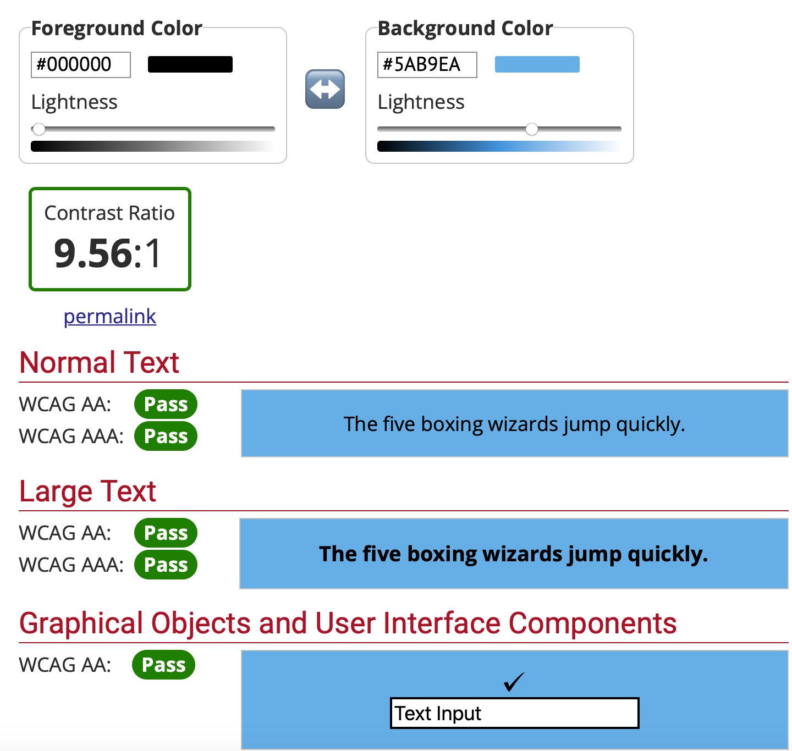
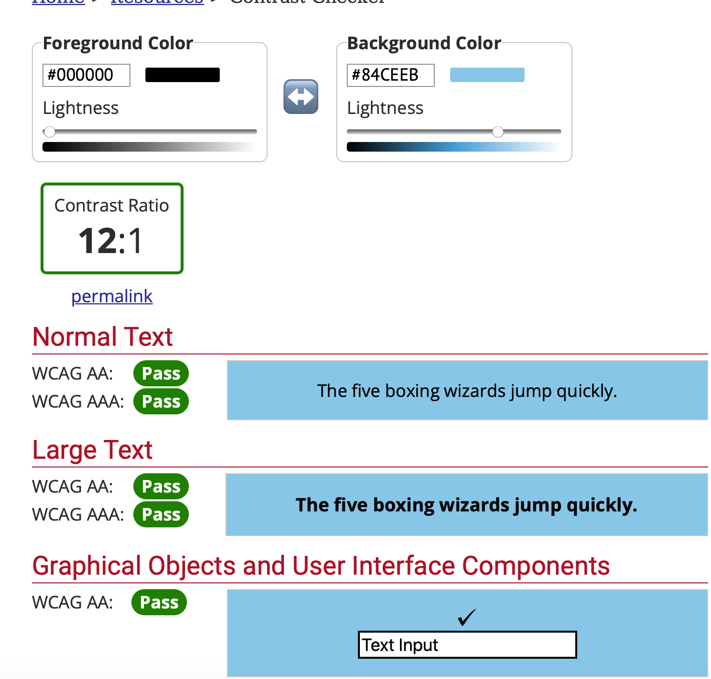
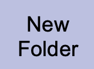
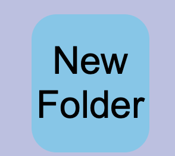

# Lab 4 Design Document And Decisions

# Introduction
The creators of this to-do list app are Aditya Bhargava (HMC '23) and Joel Tan-Aristy (HMC '24). In this lab, 
we designed and implemented an accessible to-do list using HTML, CSS, React, JavaScript, and Firebase. What makes our 
to-do list different from other to-do lists is that we have an option for showing the tasks yet to complete, folders to 
organize our tasks, different ways to sort your tasks, and additional support for multiple screen sizes  

## Accessibility
Using our application entirely from the keyboard:

Using our application using a screen reader:

We provided support for users with low vision (trouble seeing small print or objects). This was completed by making sure 
that the color contrast between the foreground and background was Normal Text WCAG AA,AAA certified and Large Text WCAG 
AA,AAA certified. The results can be seen below



We provided support for users who can't use a mouse. This was completed by making our buttons and text elements "tabbable".
Additionally, we added a function to our app so users can edit the name of folders or tasks by clicking the return button
so users don't have to click on the edit button and go back to change the name of the folder or task. Another function we
added was allowing the user to click the enter button when they want to save the changes to the folder or task name. This
again removes excessive movement as users had to traverse to the edit button when they wanted to save changes to their 
folder/task name. To make text elements tabbable, we added a 'tabIndex=0' attribute to our div container that contained 
the name of the text or folder. Our video of using our app entirely from the keyboard is above. 

We provided users who can't see at all (using a screen reader) additional support by adding aria-labels to our html elements. We found this
task to be straightforward and used the guidelines from "Guidelines for Accessible and Usable Web Sites: Observing Users 
Who Work With Screen Readers" by making the commands short, clear, and straightforward. One problem we faced was that the
user was initially unable to tab through the name of the task/folder (listen to the to-do list without having to change/edit
any aspect of the list). This was fixed by making the text elements tabbable and adding an aria-label so the screen reader
can pick up on the text element. Our video of using our app using a screen reader is above.

## Folders
Fortunately, we already implemented a folder/multiple lists of tasks functionality to our app in previous labs so it made
this significantly reduced the workload of this week's lab. We did improve our folder functionality by changing the color
of the new folder button, adding a delete folder button, and sorting the tasks in a folder by creation date. Our original
new folder button looked like this 

 

but after consulting with Prof. Rhodes, we changed the color to light blue. 



We plan on completing user testing to determine which option is the best and hope to make our app
aesthetically pleasing. Another feature we added was the delete folder button as we have been putting off this feature
for about two labs (low priority in our previous labs). This feature was quite straightforward to implement as we used the
same button for deleting completed tasks and called ```deleteDoc``` on the folder we wanted to be removed. One concern we have
is that the number of buttons on a folder (4) may be excessive and make it hard for users to navigate. The last feature 
we added to folders was sorting by creation date as we did not implement this last lab. This task was straightforward as
we used Font-Awesome to retrieve a calendar icon and sorted the tasks by the ```created``` field when querying the tasks.

## Multiple Screen Sizes
1) In-edit text mode bug


## User Testing
We completed user testing for the priority feature of our app and 4 out of 5 users found the exclamation mark to be a
useful icon for priority. They also found the way of incrementing and decrementing the number of exclamation marks to be
intuitive and easy to use. Additionally, all the users found the sorting to be helpful and thought the icons were an
appropriate display of the feature we will sort by. 


