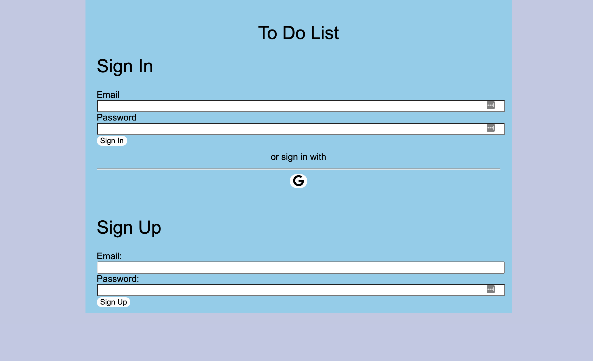
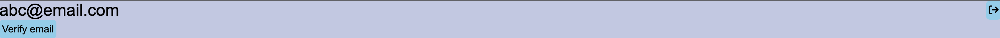
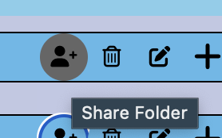

# Lab 5 Design Document And Decisions

# Introduction
The creators of this to-do list app are Aditya Bhargava (HMC '23) and Joel Tan-Aristy (HMC '24). In this lab, 
we designed and implemented an accessible to-do list using HTML, CSS, React, JavaScript, and Firebase. What makes our 
to-do list different from other to-do lists is that we have an option for showing the tasks yet to complete, folders to 
organize our tasks, different ways to sort your tasks, the ability to share folders with different users, and 
authentication/authorization support. 

## Authentication/Log In Page
We added a log in page in order to support signing in or signing up. Our main goal was to keep our UI consistent most 
log in pages, so that users have familiarity with the design. We decided to keep the sign in and sign up contents within
a different colored rectangle in order to shift the users' attention toward it. We also decided to place sign in above 
sign up (similar to UI used for many websites) since users will be using the sign in section more than the sign up.



Sign in and Sign up utilized inputs for the email and password. For each input, we decided to have text above so that 
the user understands what goes in each input. We also placed the sign in and sign up buttons below the password as is 
commonly done.

We added signing in with Google below the sign in section, so that users with Google accounts can sign in easily. We 
added text above the sign in with Google button so that users clearly understand what the button does.

## Authentication Bar
When users are signing into an account, we added a new bar at the top of the web page which contains the user's email or
name in the top left, and the sign out button in the top right. If the user has not verified their email, the verification
button will appear under the user's name or email. Upon a click, a verification email will be sent.



## Authorization
We established the authorization options of our app using Firestore's rules and by limiting our queries using the 
```where``` and ```array-contains``` clause. We allow users to share their to-do lists with the following icon

 

and allow users to "unshare" their to-do lists with the following icon


If user A shares a to-do list with a user B, then user B can read, edit, create new tasks, delete tasks, and share the task with 
other users. User B cannot delete the folder or remove user A's access to the to-do list. Additionally, user A cannot revoke 
user B's access to the to-do list as sharing access is permanent. For the UI perspective of authorization, we designed our lists 
so shared lists are minimally distinguishable from unshared lists with the trash icon being replaced by the "unshare" button for 
shared lists. 

## Other
In order to address some confusion with buttons, we added titles to each button that did not contain words. Thus, when 
the user hovers over a button for a certain amount of time, a description of the button appears like so:




## User Testing
We completed user testing for the authentication and authorization feature of our app by testing 5 users. 
3 out of 5 users found our error messages to be helpful and made the appropriate changes in an intuitive way. 
One example of this was with the 6 character password requirement Firebase enforces when signing up with email and password 
(our error message to the user relays this message in an informative way). 4 out of 5 users found the sharing buttons to be 
quite instinctive with users understanding how to share with users (click the button and a pop-up shows up) and unshare the current 
shared folder (click the unshare button near the edit button). Another feature that made the app difficult to use was the 
lack of color difference between edit and non-edit mode. The color contrast did not portray a difference (light blue vs. 
dark blue) and users were confused by which state they were in. We hope to update this in the future. 


