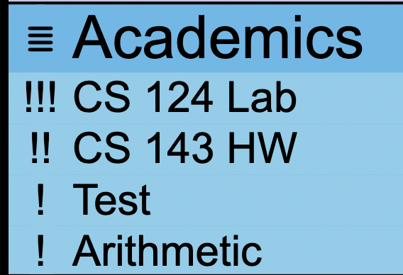
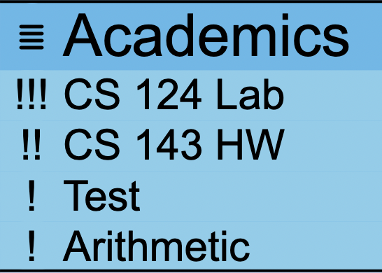
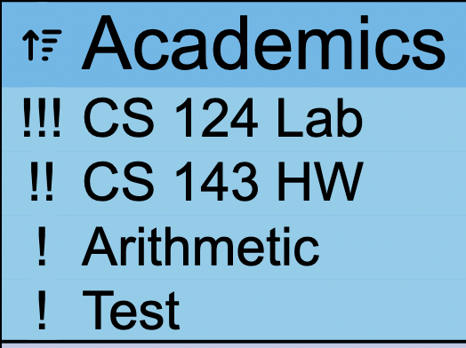
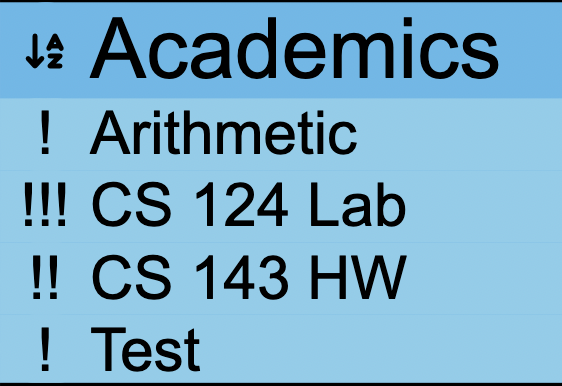
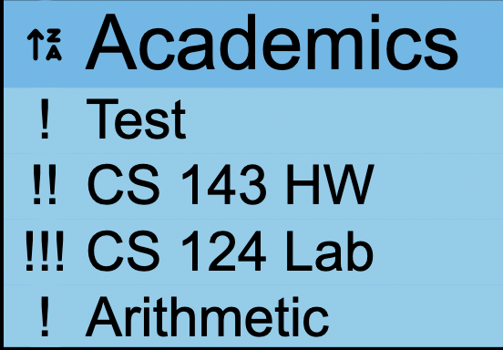

# Lab 3 Design Document And Decisions

# Introduction
The creators of this to-do list app are Aditya Bhargava (HMC '23) and Joel Tan-Aristy (HMC '24). In this lab, 
we designed and implemented a to-do list using React, JavaScript, and Firebase. What makes our to-do list different
from other to-do lists is that we have an option for showing the tasks yet to complete, folders to organize
our tasks, and different ways to sort your tasks.  

## Prioritizing Tasks
We enabled a new feature in which users can prioritize or rank tasks. To do this, the user can click on the exclamation 
mark  to the left of the task and the task will increase in priority. The button will also 
increase accordingly. A task can have a priority of at most 3, in which clicking the button then resets the priority 
back to 1. 

## Sorting of Tasks
We sorted tasks by priority, name, and creation date. This was completed using an orderBy clause in our Firebase queries
and passing the data to our Task component, so we can render our tasks in a certain order. One difficulty we faced when 
sorting tasks alphabetically is realizing that Firestore order strings by encoding order so capital letters are smaller than
lowercase letters (a distinction that is not useful to the users). To overcome this obstacle, we added a case-insensitive version of the 
taskName field to each task, so we can order the data by the case-insensitive version rather than the actual name of the task.  

The user can adjust how tasks are sorted in each individual folder using the button to the  of the
folder name. The button changes icons depending on the mode it is on. The default is the order in which the tasks are 
added (creation date), with the second being sort by . The third sort option is sort the 
tasks  and the forth is reverse . Similar to the 
priority button, once the user reaches reverse alphabetical order, clicking the sort button will return to default sort.

