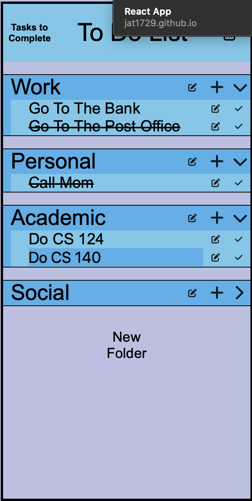
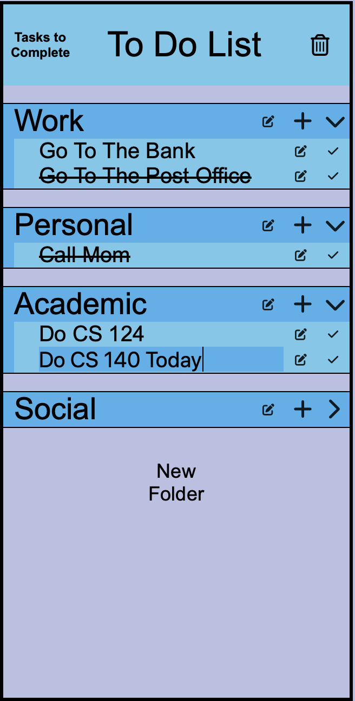

We first start by clicking the edit button to get. In this example we click the edit button by "Do CS 140".

We then click on the text box and change the name

Then we press the edit button and the changes are saved

