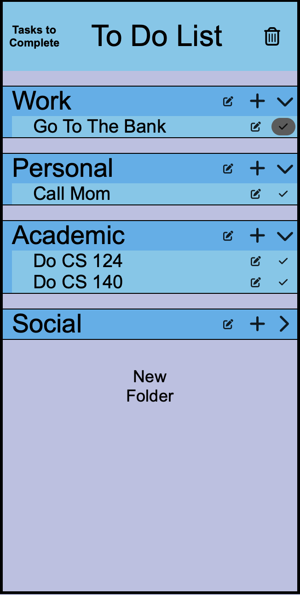
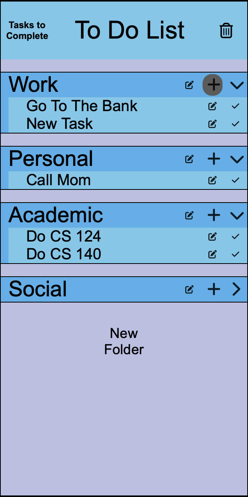
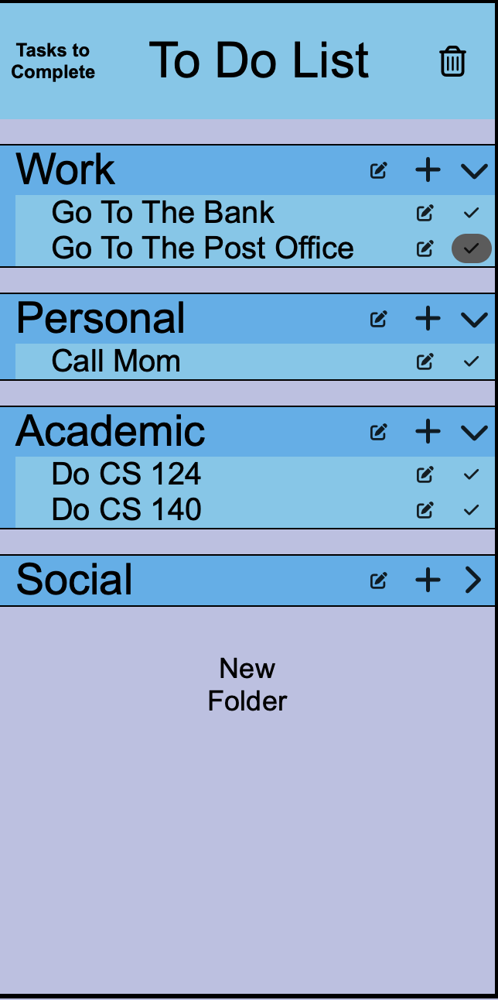

Before we add a new task, we have to choose which folder we want to add our list item to. 

When we click on the plus button of the "Work" folder, we add a list item to the Work folder. 

We rename our new task by clicking the edit button and making the appropriate actions.
