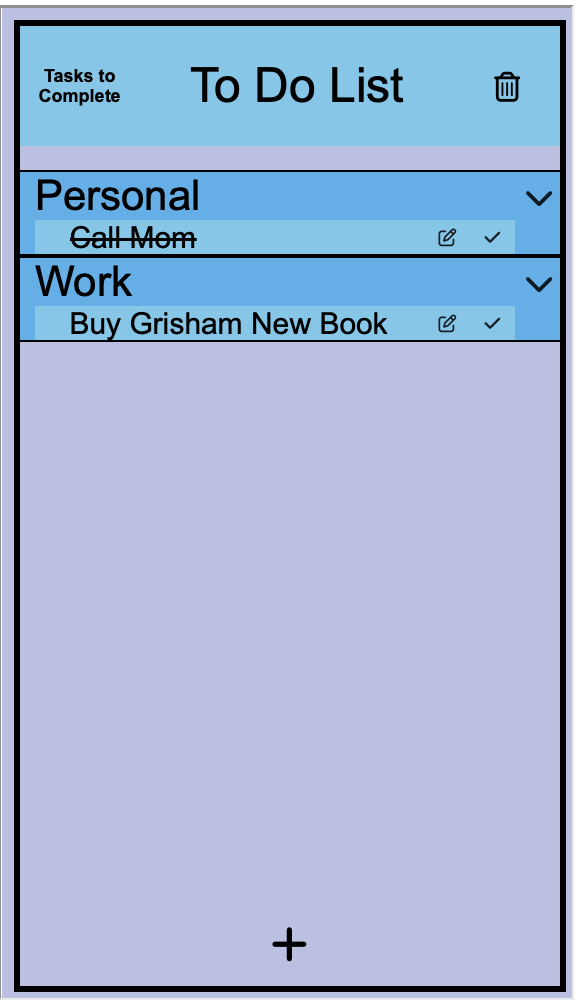
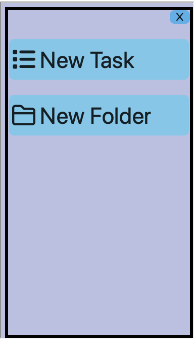
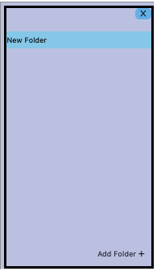
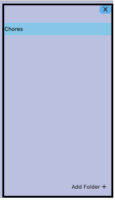
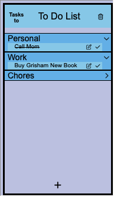

We add an element by pressing the "+" button at the bottom of the screen.

We select a "new folder" by pressing the "New Folder" button.

We enter the folder's name into a text box that has a default value of "New Folder"

We press the "Add Folder" button to submit our new folder to our to-do list.

The list after we added the "Chores" folder.
