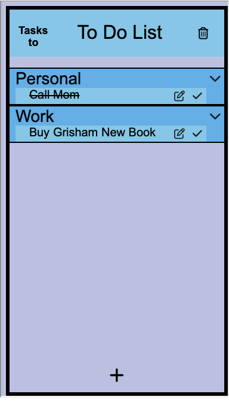
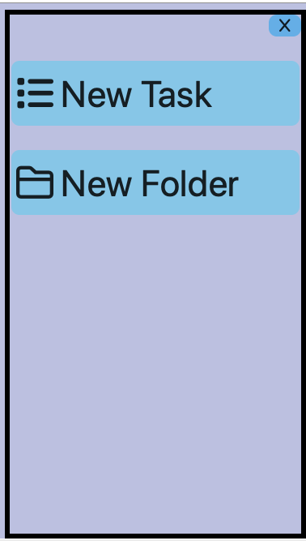
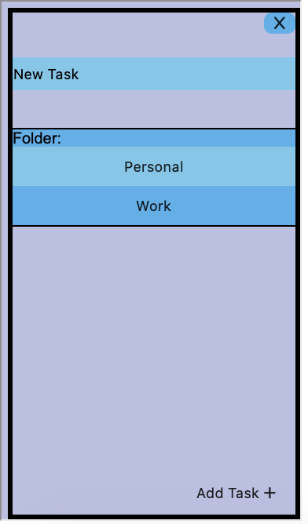
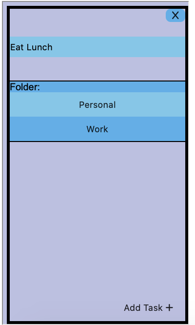
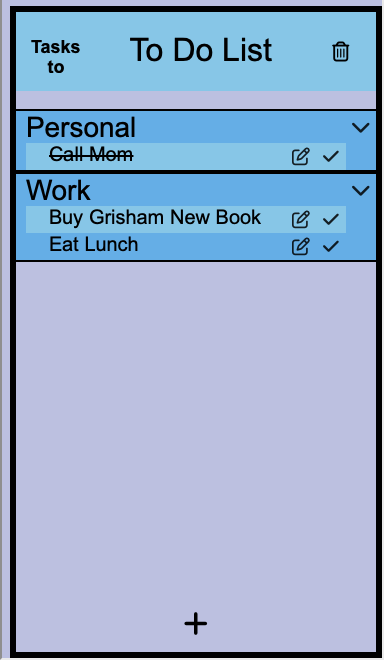

We start the process of adding a task by clicking the plus button

We choose the "New Task" button to add a new task

We selected new task and have successfully created a new task. We also need to specify which folder the new task will be
added.

We edit our new task in this window and submit it to our list by clicking the "Add Task" button.

We have successfully added our "Eat Lunch" task
