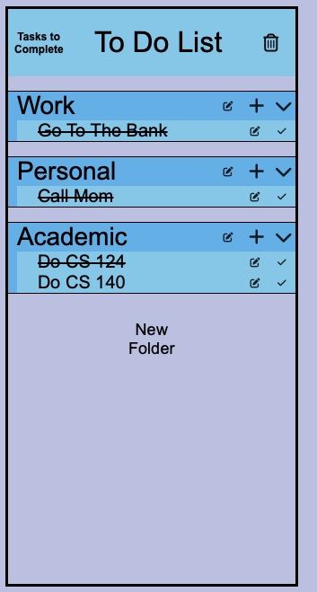
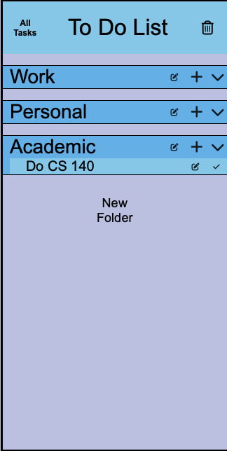
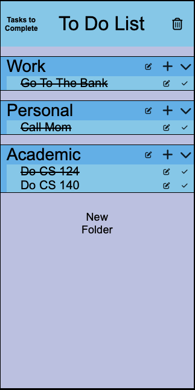

Before we click on the "tasks to complete" button, we see that our to do list has items that have been completed.

Once we click on the "tasks to complete" button, our completed items disappear and the "Tasks to Complete" button 
becomes an "All tasks" button.  

If we click on the "All tasks" button, then we can view our completed tasks again.

