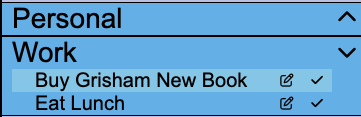
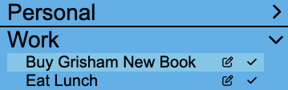

When there are no items in a category, we initially proposed having the dropdown chevron icon to be up.

After consulting with Prof. Rhodes and completing user testing, we decided to change the dropdown chevron icon to right
as its consistent with convention.

